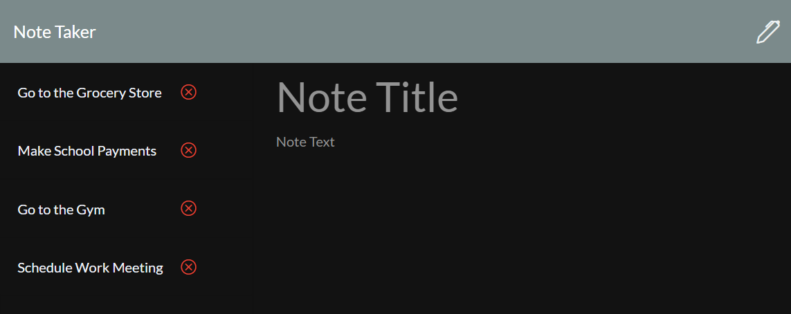
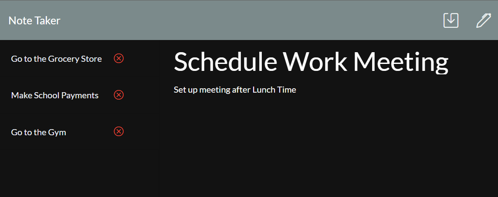

# Note Taker


## Description

This application allows the user to write and save notes through the use of [Express.js](https://expressjs.com/) in order to build a web application with the ability to write a JSON file dynamically to store/write new data into it. The application then displays the data information back through a deployed visual interface in a [Heroku](https://www.heroku.com) webpage.

The application also makes use of a [NPM](https://www.npmjs.com/) Package called [uid2](https://www.npmjs.com/package/uid2) in order to create a unique ID value and assign it to the new notes. This ID value is also stored in the JSON file database. As a Bonus, the user is also able to **_DELETE_** the notes in the application with the given ID value, and then rewrite the notes to the JSON file.

## Table of Contents

-  [User Story](#user-story)
-  [Acceptance Criteria](#acceptance-criteria)
-  [Application Output Examples](#application-output-examples)
-  [Project URLs](#project-urls)
-  [License](#license)
-  [Questions](#questions)

## User Story

```
- AS A small business owner
- I WANT to be able to write and save notes
- SO THAT I can organize my thoughts and keep track of tasks I need to complete
```

## Acceptance Criteria

```
- GIVEN a note-taking application
- WHEN I open the Note Taker
- THEN I am presented with a landing page with a link to a notes page
- WHEN I click on the link to the notes page
- THEN I am presented with a page with existing notes listed in the left-hand column, plus empty fields to enter a new note title and the note’s text in the right-hand column
- WHEN I enter a new note title and the note’s text
- THEN a Save icon appears in the navigation at the top of the page
- WHEN I click on the Save icon
- THEN the new note I have entered is saved and appears in the left-hand column with the other existing notes
- WHEN I click on an existing note in the list in the left-hand column
- THEN that note appears in the right-hand column
- WHEN I click on the Write icon in the navigation at the top of the page
- THEN I am presented with empty fields to enter a new note title and the note’s text in the right-hand column
```

## Application Output Examples

### Genrerated HTML Output:




## Project URLs

-  The URL of the deployed application in Heroku:
   https://joseepina-note-taker.herokuapp.com/

-  The URL of the GitHub repository:
   https://github.com/JoseEPina/note-taker

## License

Copyright (c) 2021 Jose E Pina. All rights reserved.

Licensed under the [MIT License](https://choosealicense.com/licenses/mit).

## Questions

Note Taker created by [JoseEPina](https://github.com/JoseEPina).

For any additional questions or comments, please send a message to the following address:

GitHub Email Address: <jose.edpina@gmail.com>
